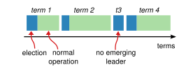
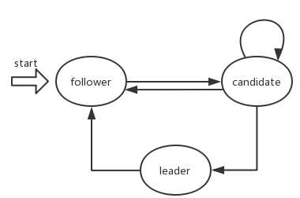

## 概念

### 1. Term

raft中，将时间划分成了一段一段的，每一段成为一个term。每当发起一次领导竞选（leader election）时，term会加1。

由图可以看到蓝色为election时期，绿色为leader带领follower正常操作时期。但也可以看到term3只有leader election，且之后马上又是leader election，但term已经变为4了。但term3到term4这是怎么回事呢？不急慢慢来，暂且先明白term的含义

### 2. HeartBeat

raft算法是一个分区容错共识算法，因此它需要具有判断分区是否发生故障。leader节点会每隔一段时间就向follower节点发送一个心跳信息，然后follower节点会返回一个消息，以此来判断节点是否发生故障或者分区故障。这个行为称为heartBeat。

### 3. election timeout

上面说了，leader节点每隔一段时间会向follower节点发送一个心跳信息。如果leader节点没有发送呢？
如果follower节点在election timeout这个时间内没有收到心跳信息，则会发起新一轮竞选。election timeout和heart beat的时间不一样，且心跳的时间远远小于election timeout

### 4. Role

各角色职责：

follower：

1. 接收心跳信息
2. 当在election timeout未接收

## 工具

### AppendEntries RPC

|Arguments:||
|:--:|:--:|
|term|leader的term|
|leaderId|leader所在服务器id|
|prevLogIndex||
|prevLogTerm||
|entries[]|日志数组|
|leaderCommit|leader当前已经commit的log index|
|**Results:**||
|term||
|success||
### RequestVote RPC

|  Arguments:  |                                 |
| :----------: | :-----------------------------: |
|     term     |          candidate的term number |
| candidateId |       candidate的id       |
| lastLogIndex | candidate最近一条日志的索引     |
| lastLogTerm  | candidate最近一条日志的term编号 |
| **Results:**     |                                 |
|     term     |                                 |
| voteGranted  |                                 |

